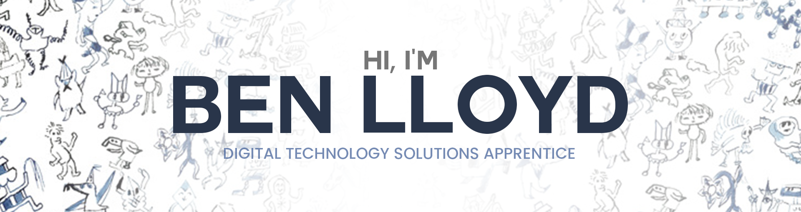

    

        <h1><b>Hi! 👋</b></h1>
    

    

        
I'm Ben, an 18 year old DTS Apprentice 💻 currently working at <a href="https://www.resonate.tech/">Resonate Ltd</a> and enrolled
            in <a href="https://www.schoolofcode.co.uk/">School of Code Bootcamp 13 🔭 </a>
        I specialise in Frontend development, but I'm hoping to become a Full-Stack developer in the future.

        <h3 align="center">Connect with me 🤝</h3>
    

    
    
    

 
 

    

        <h3>Skills 💼</h3>
    

    

        
        
        
        
        
        
        
        
        
    

 
    

        <h3>What I'm learning 🌱</h3>
    

    

        
    

 
 

    <h3>GitHub Stats 📈</h3>
    
     
     
    
     
     
    

